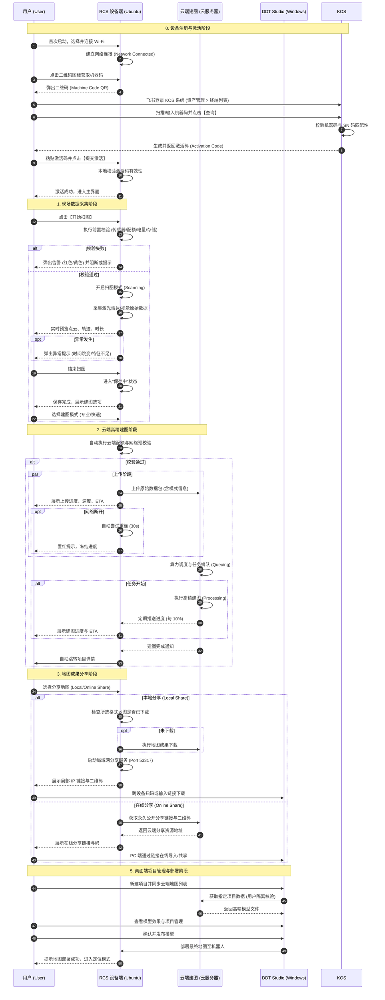

# DDT 机器人建图生态系统 - 业务时序图

以下是使用 Mermaid 语法设计的业务时序图，涵盖了 RCS 设备端应用、云端建图服务以及 DDT Studio 桌面端应用之间的交互逻辑。

### 关键业务逻辑说明：
1.  **计费校验**：云端建图在接收到建图请求后，首先通过 KOS/DDT 模块进行余额校验，确保 B 端业务的闭环。
2.  **算力调度**：云端根据当前任务并发量，通过 AXS 模块动态调度计算节点，保证建图效率。
3.  **用户隔离**：在 Studio 同步地图时，云端建图严格校验用户权限，确保地图数据在不同企业/用户间物理隔离。
4.  **数据闭环**：从 RCS 采集，到 云端建图 处理，再到 DDT Studio 编辑，最后回到 RCS 部署，形成完整的业务闭环。
